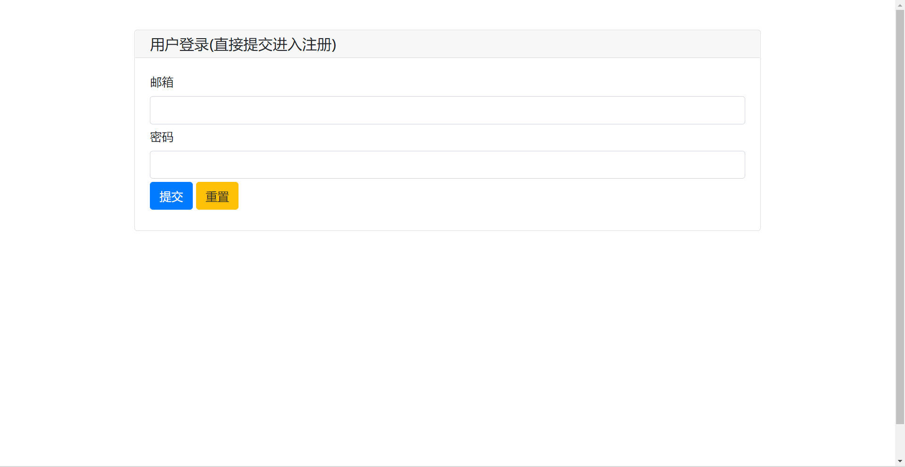
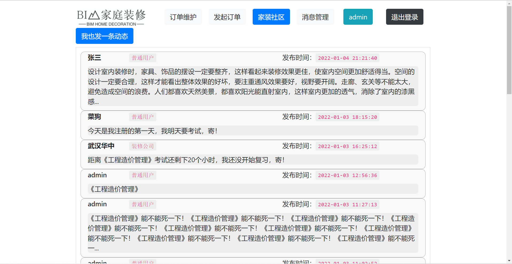
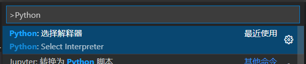

# BIM家装项目

> 执行main.py文件，然后打开http://127.0.0.1:8086
> 因为是快速开发，所以界面比较平淡，但是页面逻辑是完整的





## 0 项目进度

- [x] 图片压缩

- [x] orderDetails 中 联系装修公司 的button

- [x] orderDetails 中 重新发起订单 的button

- [x] inititateOrder 多一个 orderId 参数

- [x] inititateOrder 保存 button

- [x] 房屋地址选择的bug

- [x] 上传模型或照片的功能

  

## 1 PyWebIO

- [User’s guide — PyWebIO 1.4.0 文档](https://pywebio.readthedocs.io/zh_CN/latest/guide.html)

## 2 具体设计

### 2.1 前端

#### 2.1.1 设计缺陷

- login 界面修改，下面的 button 变为 登录—注册

#### 2.1.2 前端文件目录

- pages：放主要页面
  - costomerPage：顾客的页面文件
    - home.py：主页
    - orderDetails.py：订单维护界面
    - InitiateOrder.py：发起订单界面
    - community.py：社区界面
    - message.py：消息界面
  - decoratorPage：装修公司的页面文件
    - home.py：主页
    - checkOrder.py：查看订单界面
    - editInfo.py：编辑信息界面
    - community.py：社区界面
    - message.py：消息界面
- READMEimg：README.md 中所需要使用的图片
- static：静态对象，如图片，字体等
  - img：图片
- main.py：主程序
- README.md

### 2.2 后端


### 2.3 数据库


## 3 tips

### 3.1 基本配置

- PyWebIO 目前不支持 Python 3.9+ 的版本

- python 自动化格式选择 black 

  文件-首选项-设置，搜索 python formatting provider

- VScode 选择 python 解释器版本

  ctrl + shift + P 搜索并选择 Python ：选择解释器 

  

### 3.2 语法

#### 3.2.1 使用函数防止变量变化

- 不使用函数

下面这句最终结果导致每一个 button 都只能 toast 最后一个 key

```python
for key in messages:
    contacts.append(put_button(key, onclick=lambda: toast(key)))
```

- 使用函数，即可解决

```python
def getButton(key):
    return put_button(key, onclick=lambda: toast(key))

for key in messages:
	contacts.append(getButton(key))
```

#### 3.2.2 公共变量变化通过传参更新输出域

- 详情见代码中的 mid 函数与 mid 输出域

```python
def changeIndexName(key):
    indexName = key
    # 先移出 mid 输出域，再重新用新值加载
    remove(scope='mid')
    with use_scope("mid", clear=True):
        mid(indexName)
```

#### 3.2.3 全局变量的使用和赋值

- 外部和函数内部都要用 global声明：

  ```python
  global bimModelFilePath
  bimModelFilePath = "无"
  def getLocalFile():
      root=tk.Tk()
      root.withdraw()
  
      filePath=filedialog.askopenfilename()
      toast(filePath)
      toast("暂未设置上传功能")
      global bimModelFilePath
      bimModelFilePath = filePath
  ```

#### 3.2.4 文件上传三斜杠

- 上传文件

  ```python
  bimModelFilePath = "static\\\img\\\BIM.png"
  ```

#### 3.2.5 tinker 库 上传文件置顶

- 置顶

  ```python
  root = tk.Tk()
  root.wm_attributes('-topmost',1)
  ```

- 完整函数

  ```python
  def getLocalFile():
      root = tk.Tk()
      root.withdraw()
      root.wm_attributes('-topmost',1)
      filePath = filedialog.askopenfilename()
      toast("暂未开发上传功能")
      global bimModelFilePath
      bimModelFilePath = "static\\\img\\\BIM.png"
  ```

#### 3.2.6 可能所用到的markdown的几个表情(弃用)

- :+1:

#### 3.2.7 str -> json

- 格式转换

  ```python
  print(json.loads(shares[0][2])["text"])
  ```


#### 3.2.8 json.dumps 中文乱码

- ```python
  ensure_ascii=False
  ```

  ```python
  remarks_json = json.dumps(remarks, ensure_ascii=False)
  ```

    

